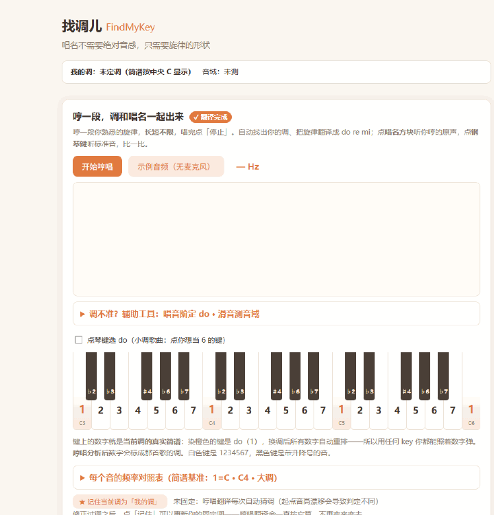

# 找调儿 FindMyKey

> 唱名不需要绝对音感，只需要旋律的形状。哼一段歌，伴奏自动来。

每个人的嗓音音高不同，但唱名（do re mi fa sol la si）是相对的。本工具帮你三件事：

1. **找到自己的 key**——哼一段滑音，测出你的舒适音域和推荐主音
2. **把哼唱翻译成简谱**——哼一段旋律，自动转成 `1 2 3 …` 唱名数字并判定调性
3. **给哼唱自动配伴奏**——从单音旋律推断参考和弦，与你的原声一起播放，**开口哼歌就能听到自己"弹唱"的完整效果**

面向不懂乐理的小白：全程大白话叙述，配钢琴键盘对照验证，无需懂任何术语。

## 视频 demo（60 秒）

<p align="center">
  <a href="https://raw.githubusercontent.com/zh2673-git/find-my-key/master/docs/img/findmykey-promo.mp4"><b>▶ 观看 60 秒宣传片</b></a>
</p>

旁白带你走完「哼一段 → 调性/简谱 → 自动伴奏 → 跟着琴键弹」全流程。本片由 [make-video](https://github.com/zh2673-git/make-video)（讲稿驱动的微视频生成工具）生成。

## 特色：哼唱自动产生伴奏

<p align="center">
  
</p>

不会乐器也能"弹唱"——这是本项目最不一样的能力：

```text
你哼的旋律 ──► 音高跟踪 ──► 音符切分 ──► ┌─► 调性判定 ──► 简谱 1 2 3 …
                                        └─► 和弦推断 ──► G ｜ D ｜ G …自动伴奏
```

- **哼完即有和弦**：按乐句把旋律切段，对每段从调内六个三和弦（1 2m 3m 4 5 6m）中评分选出最匹配的一个——和声先验、多样性判定全部内建，小调自动走 la 式体系
- **三行对齐网格**：和弦 / 简谱 / 节奏按时长同比例伸缩、逐格对齐——哪个和弦罩住哪几个音一眼可见；和弦块下的 **×N** 标注这段该弹几次（与节奏块 ×n 同一把尺），照着扫就能自己弹
- **三种弹法试听**：点和弦块即演奏——**柱式**（三音齐弹）/ **琶音**（依次滚弹）/ **🎤 弹唱**（和弦伴奏 + 那段你的原声一起播，直接听单段弹唱效果）
- **整段弹唱**：勾选「＋和弦伴奏」再点「重听我的原声」——**你哼的整段旋律自动配上和弦伴奏**，播放头随声音扫过全曲色块图，一段哼唱秒变自弹自唱
- **跟弹指引**：琴键上按顺序标好序号气泡，点对一个亮下一个——跟着点完全曲，你就把这段旋律亲手弹出来了

## 功能总览

| 功能 | 说明 |
|---|---|
| 哼唱翻译（主功能） | 哼一段熟悉的旋律（**长短不限**），一次完成：自动判定调性（大调显示 1=do，小调按中国简谱惯例以 la 为基调显示 6）+ 输出简谱唱名数字序列 |
| **哼唱自动伴奏** | 从单音哼唱推断参考和弦（见上节）——柱式 / 琶音 / 弹唱三种弹法，＋和弦伴奏整段试听，弹唱起步零门槛 |
| 辅助工具：唱音阶找 do | 唱一遍「do re mi fa sol la si」，直接判定你心中的 do 在钢琴哪个键，并逐音指出哪个音唱偏了几个琴键——判定从"猜"变成"读" |
| 辅助工具：滑音测跨度 | 从最低哼到最高（约 8 秒），测出舒适音域（如 C3–A4）与推荐主音带 |
| 大白话叙述 | 自动生成白话解读：你哼了哪些数字、开头/最高点/结尾落在哪、主音对应钢琴哪个键、下一步做什么 |
| 钢琴对照 | 键盘上实时标注当前调的简谱数字（do 键橙色强调）；点琴键听标准音 |
| A/B 试听 | 点唱名方块听你哼的**原声片段**，点钢琴键听**标准音**，耳朵自己对比验证 |
| 旋律演奏 | 「按你哼的节奏演奏」：标准音色按你哼唱的**原始节奏**连播整段旋律，钢琴键逐音高亮跟随——听到自己的旋律"正规"地响起来 |
| 实时频率反馈 | 录音时实时显示当前声音的震动频率（如 `196.0 Hz · G3`）；画布背景是当前调的简谱刻度 + 浅色"唱准带"（±30 音分），音高曲线落带即准 |
| 全曲色块图 | 分析后画布切换为全曲视图（横轴=时间、纵轴=音高，块上标简谱数字）——**点任一色块听那段原声**方便断节奏；「重听我的原声」时播放头竖线同步扫过，看的和听的走同一把时间尺 |
| 自适应音区 | 钢琴按你哼唱的旋律范围自动扩展（低至 C1 高至 C7），低音不再被挤到最左键 |
| 频率对照卡 | 当前调 1~7 和高音 do 的标准频率 + "唱准范围"（±30 音分）对照表 |
| 点琴键选 do | 觉得调判错了？勾选开关后点哪个键哪个就是 do（小调点 la），全页简谱同步刷新 |
| 我的调固定 | 把选定的调记住（存浏览器本地）：之后哼唱翻译固定按它映射唱名，不再随起点音高漂移变来变去 |
| 示例音频 | 无麦克风也能验证：内置合成《小星星》走完整分析管线（含和弦伴奏） |

## 快速启动

环境要求：Node.js ≥ 18（浏览器建议 Chrome / Edge）。

```bash
# 安装依赖
npm install

# 启动开发服务器（默认 http://localhost:5173）
npm run dev

# 生产构建（输出到 dist/，纯静态文件可任意部署）
npm run build

# 预览生产构建
npm run preview

# 运行测试（vitest，38 项离线合成音频回归）
npm test
```

首次使用麦克风时浏览器会请求授权；麦克风权限要求 `localhost` 或 HTTPS 环境。

## 使用方法

页面就一件事：**哼一段，调和唱名一起出来，伴奏也跟着来**（顶部状态条常驻显示"我的调 + 音域"）。

1. 点「开始哼唱」→ 哼一段熟悉的旋律（**长短不限**，唱完点停止）→ 自动得到：调性判定、简谱唱名数字、参考和弦、大白话叙述，钢琴键同步标成这首歌的调
2. 听弹唱：点和弦块选弹法（推荐 🎤 弹唱）逐段听；或勾「＋和弦伴奏」点「重听我的原声」听整段配乐效果
3. 验证与修正：点唱名方块听原声、点钢琴键听标准音对比；调不对就勾「点琴键选 do」或用「★ 记住当前调」固定；「更多工具」折叠区里还有唱音阶定 do / 滑音测音域

没有麦克风？点「示例音频」，内置《小星星》示例走同一套管线，可直接体验全部功能。

## 技术要点

- **核心算法零运行时依赖**（TypeScript 自实现）：YIN 音高跟踪 → 音符切分 → 调性推断（音阶覆盖率 + Krumhansl-Kessler 相关性 + 首尾音锚定）→ 首调（movable-do）唱名映射
- **和弦推断**（纯 domain 函数）：贪心分段（≥0.8s 且 ≥2 音闭合）→ 段内对 6 个调内三和弦评分（时值加权 + 首尾落根音加成 + 非和弦音扣分）→ 多样性先验破对称旋律平局 → 相邻同和弦合并；对漏音、黏连哼唱、浮点音高稳健
- **首调不变性**：低八度哼唱输出相同唱名——找的是旋律形状，不是绝对音高
- **实时采集**：AudioWorklet（16kHz）直采，关闭浏览器 AGC/降噪/回声消除
- **验证闭环**：内置合成音频真值源，vitest 离线回归 38 项全绿（含浮点 midi、和弦分段、首调不变性回归锁）；`tsc --noEmit` strict 清洁
- **四层架构**：domain（纯算法，零 IO）← application（用例编排）→ interfaces（UI）/ infrastructure（采集与回放），依赖单向

## 隐私

**录音仅在本页面内存中分析，不存储、不上传、不落盘。** 关闭页面即销毁。

## 文档

| 文档 | 内容 |
|---|---|
| [docs/01-项目方案.md](docs/01-项目方案.md) | 本质定义、目标、验证方式 |
| [docs/02-架构设计.md](docs/02-架构设计.md) | 架构与技术选型依据 |
| [docs/03-模块设计.md](docs/03-模块设计.md) | 模块划分与接口契约 |
| [docs/04–07](docs/) | 采集/YIN/调性/音域各模块四层设计 |
| [docs/08-小白翻译与琴键对照-四层设计.md](docs/08-小白翻译与琴键对照-四层设计.md) | v1.1 大白话层 + 琴键对照设计 |
| [docs/test-report-v1.md](docs/test-report-v1.md) / [test-report-v2.md](docs/test-report-v2.md) | 测试报告与 30+ 轮迭代历程 |
| [program.md](program.md) | 项目最高契约（决策表 + P/Q/I 验证） |

## 路线图（P3）

实时跟唱反馈 · 节奏量化 · 简谱/MIDI 导出 · 歌曲移调计算器 · 修正数据记忆（"选 do"记录反哺调性算法）
